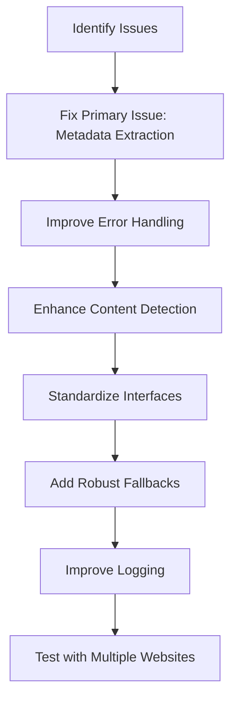

# URL Converter Fix Plan

## Overview

This document outlines a comprehensive plan to fix issues in the URL converter and related files in the Obsidian Converter application. The primary issue is that the `extractContent` method in ContentExtractor.js doesn't include metadata in its return object, causing the "Cannot read properties of undefined (reading 'title')" error when trying to access `metadata.title` in the `generateMarkdown` function.

## Identified Issues

1. **Primary Issue**: Missing metadata in ContentExtractor.js return object
2. **Related Issues**:
   - Inconsistencies between URL converter and parent URL converter implementations
   - Insufficient error handling in several places
   - Missing functionality that was in the parent URL converter but not properly transferred
   - Limited fallback mechanisms when parts of the conversion process fail
   - Inadequate logging for debugging purposes

## Implementation Plan



### 1. Fix Primary Issue: Metadata Extraction

The root cause of the error is that the `extractContent` method in ContentExtractor.js doesn't include metadata in its return object. When `generateMarkdown` in htmlToMarkdown.js tries to access `metadata.title`, it fails because metadata is undefined.

#### Implementation Steps:

1. **Update ContentExtractor.js**:
   - Modify the `extractContent` method to call `this.extractMetadataFromPage(page, baseUrl)` to extract metadata
   - Include metadata in the returned object: `{ content, images, metadata }`
   - Ensure the error handling path also returns a default metadata object

2. **Update htmlToMarkdown.js**:
   - Add defensive coding to handle cases where metadata might be undefined or null
   - Initialize metadata to an empty object if it's undefined: `metadata = metadata || {}`

### 2. Improve Error Handling

The current error handling could be improved to provide more specific error messages and better recovery from failures.

#### Implementation Steps:

1. **Enhance urlConverter.js error handling**:
   - Add more specific error types and messages
   - Improve error recovery to provide fallback content when possible
   - Add context to errors to help with debugging

2. **Update htmlToMarkdown.js error handling**:
   - Add try/catch blocks around critical sections
   - Provide fallback behavior when parts of the conversion process fail
   - Ensure errors don't propagate and crash the entire conversion process

### 3. Enhance Content Detection

The content detection logic could be improved to better handle different types of websites.

#### Implementation Steps:

1. **Improve ContentExtractor.js**:
   - Enhance the content detection algorithm to better handle modern websites
   - Add support for more content selectors
   - Improve scoring for content relevance

2. **Add fallback strategies**:
   - Implement multiple fallback strategies when main content detection fails
   - Add better handling for single-page applications (SPAs)

### 4. Standardize Interfaces

Ensure consistent interfaces between the URL converter and parent URL converter to prevent future issues.

#### Implementation Steps:

1. **Standardize return objects**:
   - Ensure both converters return objects with the same structure
   - Document the expected return structure

2. **Create shared utility functions**:
   - Move common functionality to shared utility files
   - Reduce code duplication between converters

### 5. Add Robust Fallbacks

Add fallback mechanisms to handle cases where parts of the conversion process fail.

#### Implementation Steps:

1. **Add fallback content extraction**:
   - If main content extraction fails, fall back to using the entire page
   - Add fallback metadata extraction from URL if page metadata is unavailable

2. **Add fallback title generation**:
   - If metadata title is missing, generate a title from the URL
   - Add multiple fallback sources for title extraction

### 6. Improve Logging

Enhance logging to make debugging easier and provide more insight into the conversion process.

#### Implementation Steps:

1. **Add structured logging**:
   - Use a consistent logging format
   - Include context information in logs

2. **Add performance metrics**:
   - Log timing information for key operations
   - Track success rates and failure points

### 7. Test with Multiple Websites

Implement a testing strategy to ensure the converter works with a variety of websites.

#### Implementation Steps:

1. **Create a test suite**:
   - Test with a variety of websites
   - Include edge cases and problematic sites

2. **Add automated testing**:
   - Create automated tests for the converter
   - Add regression tests for fixed issues

## Specific Code Changes

### 1. Update ContentExtractor.js - extractContent method:

```javascript
async extractContent(page, baseUrl, options = {}) {
  console.log(`📄 Extracting content from: ${baseUrl}`);
  
  try {
    // Get initial state
    const initialRawHtml = await page.content();
    console.log(`Initial raw HTML length: ${initialRawHtml.length}`);
    
    // Get cleaned state
    const cleanedRawHtml = await page.content();
    console.log(`Cleaned raw HTML length: ${cleanedRawHtml.length}`);
    
    let content = '';
    let score = 0;
    let images = [];
    let metadata = {};
    
    // Extract metadata
    try {
      metadata = await this.extractMetadataFromPage(page, baseUrl);
      console.log('Extracted metadata:', metadata);
    } catch (metadataError) {
      console.error('Error extracting metadata:', metadataError);
      // Create fallback metadata
      metadata = {
        title: this.extractTitleFromUrl(baseUrl),
        source: baseUrl,
        captured: new Date().toISOString()
      };
    }
    
    // Try enhanced content detection first
    try {
      const result = await this.findMainContent(page);
      if (result.content && result.score > 50) {
        content = result.content;
        score = result.score;
        console.log(`Found main content with score: ${score}`);
      }
    } catch (e) {
      console.error('Error in main content detection:', e);
    }
    
    // If no good content found, try fallback approaches
    if (!content || content.length < 1000 || score < 30) {
      console.log('Content too short or low quality, using fallback content');
      content = cleanedRawHtml;
    }
    
    // Extract images if requested
    if (options.includeImages) {
      images = await this.extractImages(page, baseUrl);
    }
    
    return { content, images, metadata };
  } catch (error) {
    console.error('Error extracting content:', error);
    return {
      content: `<html><body><p>Failed to extract content: ${error.message}</p></body></html>`,
      images: [],
      metadata: { 
        title: this.extractTitleFromUrl(baseUrl) || 'Error Page', 
        source: baseUrl, 
        captured: new Date().toISOString() 
      }
    };
  }
}
```

### 2. Update htmlToMarkdown.js - generateMarkdown function:

```javascript
export async function generateMarkdown(content, metadata, images, url, options) {
  try {
    console.log('Starting markdown generation...');
    
    // Ensure metadata is an object to prevent "undefined" errors
    metadata = metadata || {};
    images = images || [];
    
    // Check if content is valid
    if (!content || content.length < 10) {
      console.error('Invalid content received for markdown generation:', content);
      return `# ${metadata.title || 'Page Content'}\n\nNo content could be extracted from this page.`;
    }
    
    // Rest of the function remains the same...
```

### 3. Add defensive coding in urlConverter.js - convertToMarkdown method:

```javascript
// Extract content, metadata, and images
let content = '', metadata = {}, images = [];
try {
  const extractionResult = await this.contentExtractor.extractContent(
    page,
    finalUrl,
    {
      includeMeta: options.metadata.includeMeta,
      includeImages: options.images.includeImages,
      imageExtensions: options.images.extensions
    }
  );
  
  content = extractionResult.content || '';
  metadata = extractionResult.metadata || {};
  images = extractionResult.images || [];
  
  // Ensure metadata has at least a title
  if (!metadata.title) {
    metadata.title = this.contentExtractor.extractTitleFromUrl(finalUrl);
  }
} catch (extractionError) {
  console.error('Content extraction failed:', extractionError);
  content = `<html><body><p>Failed to extract content: ${extractionError.message}</p></body></html>`;
  metadata = { 
    title: this.contentExtractor.extractTitleFromUrl(finalUrl), 
    source: finalUrl, 
    captured: new Date().toISOString() 
  };
  images = [];
}

// Generate markdown
const markdown = await generateMarkdown(content, metadata, images, finalUrl, options);
```

## Next Steps

1. Implement the changes outlined in this plan
2. Test with multiple websites to ensure the fixes work correctly
3. Document the changes and update any related documentation